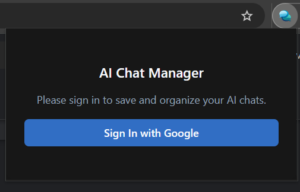

# 🚀 AI Chat Manager — User Guide (dist)

## ⚡ Quick Install (Unpacked / No build required)

1. Download and extract the ZIP containing the `dist` folder.
2. Open Chrome (or Edge/Brave) and go to `chrome://extensions` (or `edge://extensions`).
3. Enable **Developer mode** (top-right toggle).
4. Click **Load unpacked** and select the extracted `dist` folder.
5. The extension will appear in the toolbar — click it to open the popup and sign in.

## 🔐 Sign in with Google

1. Click the extension icon in the browser toolbar.
2. Click **Sign in with Google**.

3. Choose your Google account and accept the requested permission (Drive App Data).
4. After successful sign-in, the extension is ready.

> Note: This extension stores data inside your Google Drive (App Data). We do not have access to your files.

---

## ✨ Quick Start — Main Features (step-by-step)

### 1) Save a Chat (auto-save)

1. Open an AI chat on a supported platform (Gemini, ChatGPT, Claude, Perplexity).
2. Click the extension toolbar icon or use the content script button when available.
3. Choose a Tag or create a new Tag and click **Save**.

### 2) Create & Manage Tags

1. Open the sidebar from the manager (click the extension → Manager) or open `manager.html`.
2. Click **Create New Tag**.
3. Fill in Tag name then Save.

### 3) View & Open Chats

1. Select all chats from the sidebar to view all chats.
2. Single click will select a chat. Double-click a chat to open it in the same tab.

### 4) Search Chats and Tags

1. Click the search bar at the top and type your query.
2. Results update live and you can open any matched chat.

### 5) Favorites, Pin, and Bulk Actions

1. Use the star icon to favorite a chat.
2. Use checkboxes to select multiple chats and apply bulk actions (move to tag, favorite, delete).

### 6) Trash & Restore

1. Deleted chats are moved to **Trash**.
2. From Trash you can permanently delete or restore chats.

---

## 📱 Mobile & Responsive Behavior

- On narrow screens the sidebar becomes a slide-in panel with a glass effect.
- The search bar compresses on mobile to leave room for the hamburger menu.

---

## ⚙️ Settings

Open Settings to configure:

- AI platform URL patterns (add or edit platforms)
- Default title / note prefixes
- Sign out / Sign in options

---

## 🔄 Google Drive Sync (How it works)

- The extension uses OAuth and stores all data in the Drive App Data folder.
- Data is private to the signed-in Google account. When you reinstall or move to a new machine, sign in with the same account and data will be available.

---

## ❓ Troubleshooting

- If the extension isn't visible: ensure Developer mode is enabled and you loaded the `dist` folder.
- If saving fails: refresh the page and try again or reload the extension.
- If Google Sign-In fails: check network, sign out and sign in again.

---

Made with ❤️ by [iamudara](https://github.com/iamudara) — enjoy!
