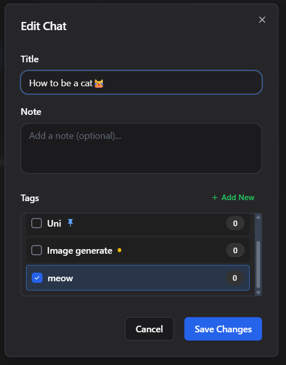

# 🚀 AI Chat Manager Extension

**Save, organize, and manage your AI chat conversations** from Gemini, ChatGPT, Claude, and Perplexity in one place with Google Drive sync.

---

## 📥 Installation

### Quick Start (3 steps)

1. **Download** this repository as ZIP (click the green "Code" button → "Download ZIP")
3. **Load in your browser**:
    - Open your browser and go to the extensions page:
      - Chrome: `chrome://extensions/`
      - Edge: `edge://extensions/`
      - Brave: `brave://extensions/`
    - Enable **Developer mode** (toggle in the top-right)
    - Click **Load unpacked** (or **Load unpacked extension**)
    - Select the `dist` folder from the extracted files
    - Done! 🎉

> **Note**: Works on Chrome, Edge, Brave, and other Chromium-based browsers.

---

## 🔐 First Time Setup

### Sign in with Google

1. Click the extension icon in your browser toolbar
2. Click **Sign in with Google**
3. Choose your Google account
4. Grant permission for Drive App Data access
5. You're ready to start saving chats!


> **Privacy**: Your data is stored in **your** Google Drive (App Data folder). We cannot access your data.

---

## 📖 How to Use

### 1️⃣ Save Your First Chat

**From any AI chat page:**

1. Open a conversation on Gemini, ChatGPT, Claude, or Perplexity
2. Click the extension icon in your toolbar
3. A save dialog appears:
   - Enter a **title** for your chat (auto-filled from platform)
   - Add an optional **note**
   - Select one or more **tags** (or create new ones)
4. Click **Save Chat**


**✨ Tip**: The extension auto-detects which AI platform you're on and suggests a title!

---

### 2️⃣ Open the Manager

**Two ways to access:**

- **Popup View**: Click the extension icon → view recent chats
- **Full Manager**: Click the extension icon → click **Manager** button


**Manager Interface:**

- **Sidebar** (left): Navigate between Tags, All Chats, Favorites, Trash, Settings
- **Main Area** (center): View and manage your chats
- **Search Bar** (top): Find anything instantly

---

### 3️⃣ Create & Organize Tags

**Tags help you organize chats by topic, project, or category.**

1. In the Manager, click **+ Create New Tag**
2. Enter a tag name (e.g., "Work", "Research", "Code Help")
3. Click **Create Tag**


**Pro Features:**

📌 **Pin to Quick Access** (max 3 tags)

- Click the pin icon on any tag
- Pinned tags appear at the top with a blue dot
- They appear in the quick access at the popup view


- Perfect for your most-used categories

⭐ **Mark as Favorite**

- Click the star icon on any tag
- Favorite tags show with a yellow star
- Sorted near the top (below pinned tags)


---

### 4️⃣ View & Manage Chats

**Browse your saved chats:**

1. Click a tag in the sidebar to filter chats
2. Click **All Chats** to see everything
3. **Single-click** a chat to select it
4. **Double-click** a chat to open the original URL


**Visual Indicators:**

- ⭐ Yellow star = Favorited chat
- 📌 Blue pin = Pinned tag

---

### 5️⃣ Edit Chat Details

**Update title, notes, or tags:**

1. Go to the All Chats menu from the sidebar or select a specific tag
1. Hover over a chat 
2. Click the **Edit** button
3. Modify:
   - Title
   - Note
   - Tags (add or remove)
4. Click **Save Changes**




---

### 6️⃣ Search Everything

**Find chats quickly:**

1. Click the search bar at the top
2. Type your query
3. Results update live as you type
4. Search finds matches in:
   - Chat titles
   - Notes
   - Tag names
   - Settings


**Search Tips:**

- Search works across all chats and tags
- Results sorted by relevance
- Click any result to view it

---

### 7️⃣ Use Favorites

**Quick access to important chats:**

**Favorite a Chat:**

- Click the ⭐ star icon on any chat
- Favorited chats appear at the top of lists
- Access all favorites from the **Favorites** folder in sidebar


**Favorite a Tag:**

- Click the ⭐ star icon on any tag
- Favorite tags sorted near the top
- Use when you don't want to use a pin slot


**Favorites Folder:**

- Static folder in sidebar
- Shows all favorited chats
- Sorted with favorites at top

---

### 8️⃣ Bulk Actions

**Manage multiple chats at once:**

1. **Select Multiple**: Click checkboxes on multiple chats
2. **Select All**: Use the "Select All" checkbox
3. **Apply Action**:
   - ⭐ **Favorite** all selected
   - 🏷️ **Move** to different tag
   - 🗑️ **Delete** (move to trash)
   - ♻️ **Restore** from trash


**Bulk Actions Menu:**

- Appears when you select chats
- Shows count of selected items
- One-click operations

---

### 9️⃣ Trash & Recovery

**Safe deletion with recovery option:**

**Move to Trash:**

- Click the 🗑️ trash icon on any chat
- Or use bulk delete for multiple chats
- Chats stay in trash until permanently deleted

**From Trash:**

- Click **Trash** in sidebar
- ♻️ **Restore**: Recover deleted chats
- 🗑️ **Delete Permanently**: Remove forever


⚠️ **Warning**: Permanent deletion cannot be undone!

---

### 🔟 Sort Your Chats

**Organize how you view chats:**

1. Click the sort dropdown (⋮ icon next to view title)
2. Choose sorting:
   - **By Name**: Alphabetical order
   - **By Modified**: Most recent first

**Auto-sorting:**

- Pinned tags always at top
- Favorites sorted above regular items
- Within each group, your chosen sort applies

---

### 1️⃣1️⃣ Configure AI Platforms

**Add or customize AI platforms:**

1. Click **Settings** in sidebar
2. View pre-configured platforms:
   - Gemini
   - ChatGPT
   - Claude
   - Perplexity
3. Click **+ Add Platform** to add custom platforms


**Platform Configuration:**

- **URL Pattern**: Website URL to match
- **Title Prefix**: Default prefix for new chats
- **Note Prefix**: Auto-fill notes with prefix

**Example Custom Platform:**

```
Name: Copilot
URL Pattern: https://copilot.microsoft.com/
Title Prefix: Copilot-
Note Prefix: Copilot chat for
```

---

## 📱 Mobile & Small Screens

**Fully responsive design:**

- **Sidebar**: Becomes a slide-in panel with hamburger menu (☰)
- **Glassmorphism**: Sidebar has a frosted glass effect on mobile
- **Touch-friendly**: All buttons optimized for touch
- **Compact search**: Search bar adapts to smaller screens


**Mobile Controls:**

- Tap ☰ to open sidebar
- Tap outside sidebar to close
- All features work the same

---

## ☁️ Google Drive Sync

**How it works:**

- **Auto-sync**: Data saves automatically to Google Drive
- **Private**: Stored in Drive App Data folder (hidden from Drive UI)
- **Secure**: Only you can access your data
- **Cross-device**: Sign in on any device to access your chats
- **Offline**: Changes queue and sync when online


**Benefits:**

- ✅ Never lose your data
- ✅ Use extension on multiple computers
- ✅ Automatic backup
- ✅ No manual exports needed

---

## 💡 Pro Tips

### Organizing Strategy

- **Pin** your 3 most-used tags for instant access
- **Favorite** tags you use often but not daily
- **Tag** chats with multiple tags for better findability
- **Favorite** important chats for quick reference

### Workflow Examples

- **Work vs Personal**: Create "Work" and "Personal" tags
- **By Project**: Tag chats by project name
- **By Topic**: Create tags like "Coding", "Writing", "Research"
- **Temporary**: Use a "To Review" tag for chats to process later

### Keyboard Shortcuts

- **Enter**: Save in any modal/dialog
- **Escape**: Close modals
- **Double-click**: Open chat URL
- **Single-click**: Select chat

---

## 🔧 Troubleshooting

### Extension not appearing

- ✅ Ensure Developer mode is enabled
- ✅ Check you loaded the correct folder
- ✅ Look for manifest.json in the folder
- ✅ Try reloading the extension

### Can't save chats

- ✅ Make sure you're signed in with Google
- ✅ Refresh the AI chat page
- ✅ Check internet connection
- ✅ Reload the extension

### Google Sign-In fails

- ✅ Check internet connection
- ✅ Try signing out and signing in again
- ✅ Clear browser cache
- ✅ Make sure you're using a supported browser

### Chats not syncing

- ✅ Check you're signed in
- ✅ Verify internet connection
- ✅ Try signing out and back in
- ✅ Check Google Drive permissions

### Changes not appearing

- ✅ Wait a moment (syncing with Drive)
- ✅ Refresh the extension
- ✅ Check your internet connection

---

## 📊 Features Summary

| Feature             | Description                         |
| ------------------- | ----------------------------------- |
| 🏷️ **Tags**         | Organize chats into categories      |
| 📌 **Quick Access** | Pin up to 3 tags for instant access |
| ⭐ **Favorites**    | Mark important chats and tags       |
| 🔍 **Search**       | Find anything instantly             |
| 📦 **Bulk Actions** | Manage multiple chats at once       |
| 🗑️ **Trash**        | Safe deletion with recovery         |
| ☁️ **Drive Sync**   | Automatic cloud backup              |
| 📱 **Responsive**   | Works on all screen sizes           |
| 🎨 **Modern UI**    | Clean, dark theme interface         |
| ⚙️ **Customizable** | Add your own AI platforms           |

---

## 🎯 Supported Platforms

✅ **Pre-configured:**

- Google Gemini
- ChatGPT (OpenAI)
- Claude (Anthropic)
- Perplexity AI

➕ **Add your own:**

- Any AI chat platform
- Custom configuration
- URL pattern matching

---

## 📸 Adding Screenshots

**For repository maintainers:**

1. Create an `images` folder in the repo root
2. Take screenshots of each feature (1200px width recommended)
3. Save as PNG with descriptive names
4. Reference in README as: ``

**Screenshot checklist:**

- [ ] `screenshot-signin.png` - Google sign-in dialog
- [ ] `screenshot-save-chat.png` - Save chat dialog
- [ ] `screenshot-popup-manager.png` - Popup vs Manager view
- [ ] `screenshot-create-tag.png` - Create tag modal
- [ ] `screenshot-pin-quick-access.png` - Pinned tags
- [ ] `screenshot-chats-list.png` - Chat list view
- [ ] `screenshot-edit-chat.png` - Edit chat modal
- [ ] `screenshot-search.png` - Search results
- [ ] `screenshot-favorites.png` - Favorites view
- [ ] `screenshot-bulk-actions.png` - Bulk actions UI
- [ ] `screenshot-trash.png` - Trash folder
- [ ] `screenshot-settings.png` - Settings page
- [ ] `screenshot-mobile-sidebar.png` - Mobile responsive view


---


## 🐛 Issues & Support

Found a bug or have a feature request?

- 📝 Report issues: [GitHub Issues](https://github.com/iamudara/AI-Chat-Manager-Extension/issues)
- 💬 Questions: Open a discussion on GitHub
- ⭐ Like it? Give us a star!

---

## 🚀 Version

**Current Version**: 1.0.0

See [CHANGELOG.md](CHANGELOG.md) for version history and updates.

---

**Made with ❤️ by [iamudara](https://github.com/iamudara)**

_Enjoy organizing your AI conversations!_ ✨
